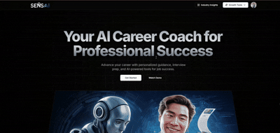

# AI Career Coach



**Live Demo:** [https://vercel.com/lavkushs-projects-c02800e6/career-lens](https://vercel.com/lavkushs-projects-c02800e6/career-lens)

A full-stack, AI-powered career coaching platform to help users build resumes, generate cover letters, prepare for interviews, and gain industry insights.

---

## 🚀 Features
- **AI Resume Builder**: Create and optimize your resume with AI feedback and ATS scoring.
- **AI Cover Letter Generator**: Generate tailored cover letters for specific jobs and companies.
- **Interview Preparation**: Take quizzes, track performance, and receive improvement tips.
- **Industry Insights**: Get salary trends, growth rates, and in-demand skills for your industry.
- **User Onboarding & Authentication**: Secure sign-up/sign-in with Clerk.
- **Modern UI**: Built with Shadcn UI, TailwindCSS, and Radix UI components.

---

## 🛠️ Tech Stack
- **Frontend/Backend**: [Next.js](https://nextjs.org/)
- **Database**: [NeonDB (PostgreSQL)](https://neon.tech/) via [Prisma ORM](https://www.prisma.io/)
- **Authentication**: [Clerk](https://clerk.com/)
- **AI**: [Google Generative AI](https://ai.google.dev/)
- **UI**: [Shadcn UI](https://ui.shadcn.com/), [Radix UI](https://www.radix-ui.com/), [TailwindCSS](https://tailwindcss.com/)
- **Background Jobs**: [Inngest](https://www.inngest.com/)

---

## 🗄️ Database Models (Prisma)
- **User**: Profile, skills, experience, resume, cover letters, assessments
- **Assessment**: Quiz results, improvement tips
- **Resume**: Markdown content, ATS score, feedback
- **CoverLetter**: Content, job/company info, status
- **IndustryInsight**: Salary ranges, trends, skills, market outlook

---

## 📦 Getting Started

### 1. Clone the repository
```bash
git clone <repo-url>
cd ai-career-coach
```

### 2. Install dependencies
```bash
npm install
```

### 3. Set up environment variables
Create a `.env` file in the root directory with the following:
```env
DATABASE_URL=postgres://<username>:<password>@<host>:<port>/<db>

NEXT_PUBLIC_CLERK_PUBLISHABLE_KEY=your_clerk_publishable_key
CLERK_SECRET_KEY=your_clerk_secret_key

NEXT_PUBLIC_CLERK_SIGN_IN_URL=/sign-in
NEXT_PUBLIC_CLERK_SIGN_UP_URL=/sign-up
NEXT_PUBLIC_CLERK_AFTER_SIGN_IN_URL=/onboarding
NEXT_PUBLIC_CLERK_AFTER_SIGN_UP_URL=/onboarding

GEMINI_API_KEY=your_google_generative_ai_key
```

### 4. Run database migrations
```bash
npx prisma migrate deploy
```

### 5. Start the development server
```bash
npm run dev
```

---

## 📜 Scripts
- `npm run dev` – Start Next.js in development mode
- `npm run build` – Build for production
- `npm start` – Start production server
- `npm run lint` – Run ESLint

---

## 🤝 Contributing
Pull requests are welcome! For major changes, please open an issue first to discuss what you would like to change.

---

## 📄 License
[MIT](LICENSE) (add a LICENSE file if you want to specify this)

---

## 📣 Credits
- Inspired by [Shadcn UI](https://ui.shadcn.com/), [Clerk](https://clerk.com/), [Prisma](https://www.prisma.io/), and [Inngest](https://www.inngest.com/).
- [YouTube Tutorial](https://youtu.be/UbXpRv5ApKA)
